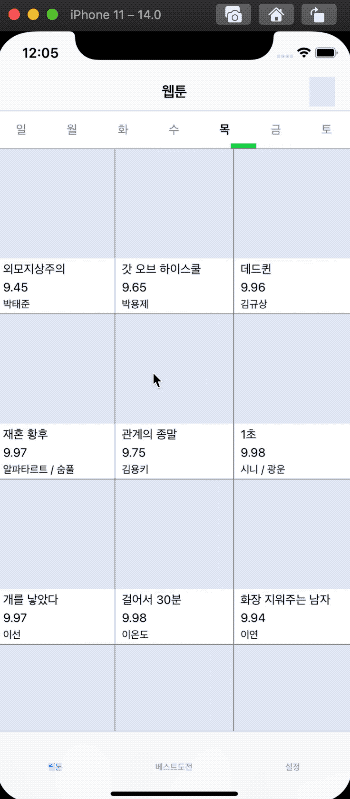
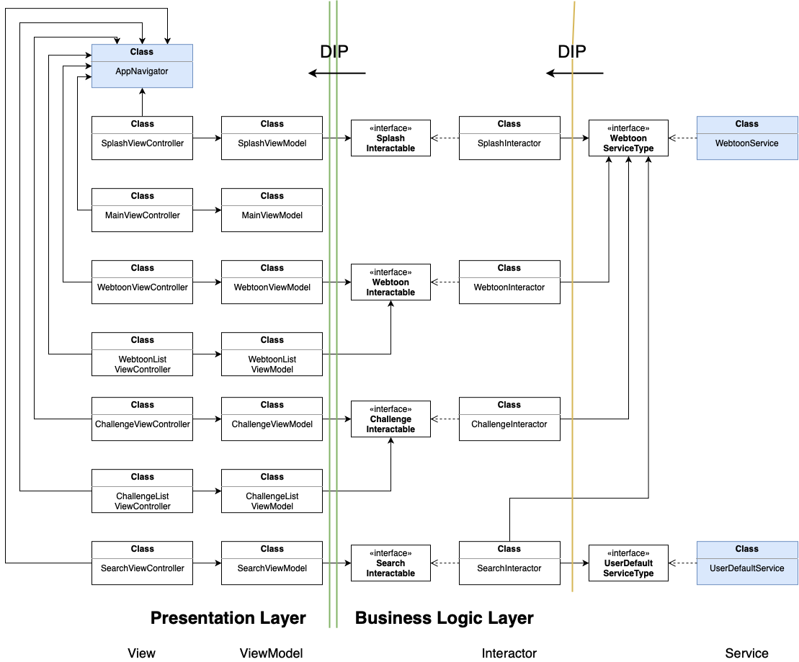

# 네이버웹툰 iOS앱 클론코딩

## Architecture

MVVM with UIKit + RxSwift

### Presentation Layer

- ViewController
- ViewModel
- Navigator

### Business Logic Layer

- Interactors (DIP)
- Serivces (DIP)

### Entity Layer

- Models

---

## ETC

- Localize
- Code based autolayout
- Method chaining for building views
- Using a property wrapper for UserDefault
- UI Preview

---

## Libraries

- Kingflisher
- Moya
- RxSwift
- SnapKit
- Resolver

---

## Environment

- XCode 12.1
- Swift 5.2
